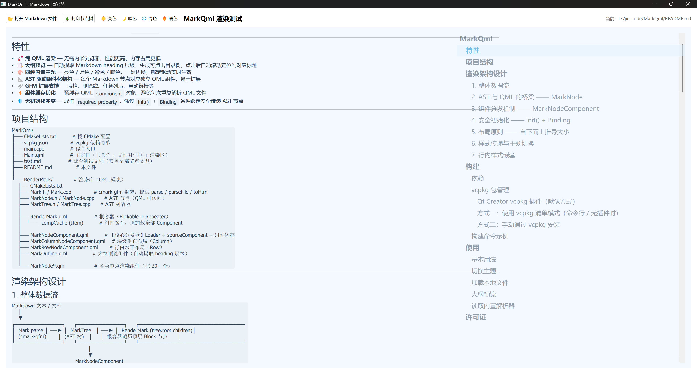

# MarkQml

[简体中文](./README.md)

A native **Qt 6 + QML** Markdown renderer powered by `cmark-gfm`. It parses Markdown text into an AST (Abstract Syntax Tree) and recursively renders it through QML components — no WebEngine required.

---

## Features

- 🚀 **Pure QML Rendering** — No embedded browser, higher performance and lower memory footprint
- 📑 **Outline Preview** — Automatically extracts Markdown heading hierarchy into a clickable table of contents; click to scroll to the corresponding heading
- 🖼️ **Per-node Callbacks** — Every AST node type exposes a `<type>NodeCallback` that receives the rendered QML Item when the node finishes loading, ideal for attaching click handlers or further customization
- 🎨 **Four Built-in Themes** — Light / Dark / Cold / Warm, one-click switching with binding-driven live updates
- 📐 **AST-Driven Componentized Architecture** — Each Markdown node maps to an independent QML component, easy to extend
- 🔗 **GFM Extension Support** — Tables, strikethrough, task lists, autolinks, and more
- ⚡ **Component Cache Optimization** — Pre-caches QML `Component` objects to avoid repeated QML file parsing
- 🛡️ **No Initialization Conflicts** — Eliminates `required property` issues; safely passes AST nodes via `init()` + conditional `Binding`

---

## Screenshot



---

## Project Structure

```
MarkQml/
├── CMakeLists.txt          # Root CMake configuration
├── vcpkg.json              # vcpkg dependency manifest
├── main.cpp                # Application entry point
├── Main.qml                # Main window (toolbar + file dialog + render area)
├── test.md                 # Comprehensive test document (covers all node types)
├── README.md               # This file
│
└── RenderMark/             # Rendering library (QML module)
    ├── CMakeLists.txt
    ├── Mark.h / Mark.cpp              # cmark-gfm wrapper; provides parse / parseFile / toHtml
    ├── MarkNode.h / MarkNode.cpp      # AST node (accessible from QML)
    ├── MarkTree.h / MarkTree.cpp      # AST tree container
    │
    ├── RenderMark.qml                 # Root container (Flickable + Repeater)
    │   └── _compCache (Item)          # Component cache; preloads all Components
    │
    ├── MarkNodeComponent.qml          # [Core dispatcher] Loader + sourceComponent + cache
    ├── MarkColumnNodeComponent.qml    # Block-level vertical layout (Column)
    ├── MarkRowNodeComponent.qml       # Inline horizontal layout (Row)
    ├── MarkOutline.qml                # Outline preview component (auto-extracts heading hierarchy)
    │
    └── MarkNode*.qml                  # Various node rendering components (20+ files)
```

---

## Rendering Architecture

### 1. Overall Data Flow

```
Markdown text / file
    │
    ▼
┌─────────────┐     ┌─────────────┐     ┌─────────────────────────────┐
│  Mark.parse │ ──► │  MarkTree   │ ──► │  RenderMark (tree.root.children)│
│  (cmark-gfm)│     │  (AST tree) │     │  Root container iterates top-level Block nodes│
└─────────────┘     └─────────────┘     └─────────────────────────────┘
                                                │
                                                ▼
                                        MarkNodeComponent
                                          (Loader dispatch)
                                                │
                    ┌─────────────┬─────────────┼─────────────┬─────────────┐
                    ▼             ▼             ▼             ▼             ▼
              MarkNodeText  MarkNodeLink  MarkNodeItem  MarkNodeTable  ...
```

### 2. Bridge Between AST and QML — MarkNode

`MarkNode` inherits from `QObject` and is registered as `QML_ELEMENT`. Each AST node appears in QML as a JavaScript object with the following information:

| Property | Description | Applicable Nodes |
|----------|-------------|------------------|
| `type` | Node type string | All |
| `content` | Plain text content | text / code / html etc. |
| `children` | Child node list (`QVariantList`) | All |
| `level` | Heading level h1~h6 | heading |
| `url` / `title` | Link address and title | link / image |
| `ordered` / `start` | Ordered list flag and starting number | list |
| `columns` / `alignments` | Column count and alignment | table |
| `language` | Code language identifier | code_block |
| `parentNode` | Logical parent node | All |

In addition, `MarkNode` provides a set of convenient `isXxx()` methods (e.g. `isHeading()`, `isLink()`) for quick dispatch on the QML side.

### 3. Component Dispatch Mechanism — MarkNodeComponent

`RenderMark.qml` traverses `tree.root.children` via `Repeater`; each child node is handled by a `MarkNodeComponent` (essentially a `Loader`).

`MarkNodeComponent` adopts a **component caching** strategy:

1. `RenderMark` maintains `_compCache` (an `Item` container) which preloads all 26 `Component` objects;
2. `MarkNodeComponent` selects the corresponding `Component` from the cache via a `sourceComponent` binding based on `astNode` type;
3. In `Loader.onLoaded`, it calls `item.init(astNode, astStyle)` to initialize, and also passes `cache`;
4. If `Repeater` reuses a delegate but the `Loader`'s `item` is unexpectedly `null`, it forces a reload by resetting `sourceComponent` through `Qt.callLater`.

```qml
Loader {
    id: root
    property var astNode: null
    property var astStyle: null
    property var cache: null

    sourceComponent: {
        var node = astNode;
        var c = cache;
        if (!c || !node) return null;
        if (node.isDocument()) return c.document;
        if (node.isParagraph()) return c.paragraph;
        // ... other branches
        return null;
    }

    onLoaded: {
        if (item && item.cache !== undefined) item.cache = root.cache;
        if (item && item.init) item.init(root.astNode, root.astStyle);
    }
}
```

**Key points**:
- **Block-level nodes** (paragraph, heading, list, block_quote, etc.) usually enter `MarkColumnNodeComponent.qml` or `MarkRowNodeComponent.qml` first, then continue dispatching child nodes through nested `MarkNodeComponent`s recursively.
- **Inline nodes** (text, link, code, strong, etc.) render directly inside a `Row`.
- **Special nodes** (table) use **flattened rendering**: `MarkNodeTable.qml` arranges all `table_cell`s in a single `GridLayout` to ensure column widths align automatically, rather than rendering `table_header` / `table_row` independently.

### 4. Safe Initialization — init() + Binding

To avoid initialization timing conflicts between `required property` and `Loader`, all rendering components uniformly adopt the following pattern:

```qml
Rectangle {
    id: root
    property var astNode: null
    property var astStyle: null

    function init(node, style) {
        astNode = node;
        astStyle = style;
    }

    // All properties depending on astNode / astStyle use Binding + when condition
    Binding on color {
        value: root.astStyle.codeBackground
        when: root.astStyle !== null
    }
}
```

- `init()` is called inside `Loader.onLoaded`, ensuring `astNode` / `astStyle` are ready before assignment;
- The `when` condition of `Binding` guarantees no property access is triggered in the `null` state, completely avoiding `TypeError: Cannot read property 'xxx' of undefined`.

### 5. Layout Principle — Bottom-Up Size Derivation

The QML components in this project follow a **bottom-up** size derivation principle:

- Parent container size is determined by child content (`childrenRect.width/height`, `implicitWidth/implicitHeight`)
- Avoids circular dependencies caused by `width: parent.width` or `anchors.fill: parent`
- Typical example: `MarkNodeCodeBlock.qml`'s `Rectangle` width and height are bound directly to its inner `Column`'s `childrenRect`

```qml
Rectangle {
    width: childrenRect.width
    height: childrenRect.height
    // Inner Column naturally derives its size; Rectangle follows content
}
```

### 6. Style Passing and Theme Switching

`RenderMark.qml` maintains a `QtObject`-based `markStyle` object (no longer a plain JS object):

```qml
QtObject {
    id: markStyle
    property color textColor: "#2c3e50"
    property color linkColor: "#3498db"
    property color codeBackground: "#eaf2f8"
    // ...
}
```

All child components receive this object through the `astStyle` property. Because `QtObject` supports property change notifications, all `Binding`s automatically re-evaluate when switching themes — **no need to destroy and recreate components**.

```qml
renderMark.setDarkTheme()   // Dark
renderMark.setLightTheme()  // Light
renderMark.setColdTheme()   // Cold (default)
renderMark.setWarmTheme()   // Warm
```

### 7. Inline Style Nesting

For nested structures like `**[bold link](url)**`, the AST is represented as `strong → link → text`. The handling approach is:

1. `strong` no longer assumes its child must be `text`; instead it creates `MarkNodeStrong.qml`, which uses `MarkRowNodeComponent` to recursively render all child nodes.
2. `MarkNodeText.qml` determines whether to apply `bold`, `italic`, `underline`, or `strikeout` by **traversing ancestor nodes** rather than only checking the parent node.

```qml
font.bold: {
    var p = astNode.parentNode;
    while (p) {
        if (p.isStrong && p.isStrong()) return true;
        p = p.parentNode;
    }
    return false;
}
```

This correctly propagates styles through arbitrary nesting depths (e.g. `strong → emphasis → link → text`).

---

## Build

### Dependencies

- Qt 6.8+
- CMake 3.16+
- cmark-gfm (with extensions) — **managed via vcpkg**

### vcpkg Package Management

This project uses [vcpkg](https://github.com/microsoft/vcpkg) as the C++ dependency package manager. The `vcpkg.json` in the project root is a **manifest** that defines the required dependencies:

```json
{
  "name": "markqml",
  "version": "0.1.0",
  "dependencies": [
    "cmark-gfm"
  ]
}
```

The vcpkg port for `cmark-gfm` automatically pulls the core library and all extensions (table, strikethrough, autolinks, tagfilter, tasklist); there is no need to declare extensions separately in `vcpkg.json`.

#### Qt Creator vcpkg Plugin (Default)

This project assumes by default that you have installed and configured the [vcpkg plugin](https://doc.qt.io/qtcreator/creator-vcpkg.html) in **Qt Creator**. The plugin automatically recognizes the `vcpkg.json` in the project root and downloads and integrates dependencies in the background, without requiring you to manually specify `CMAKE_TOOLCHAIN_FILE` on the CMake command line.

#### Option 1: vcpkg Manifest Mode (Command Line / No Plugin)

If you are not using the Qt Creator vcpkg plugin and don't want to pass `-DCMAKE_TOOLCHAIN_FILE` every time on the command line, you can add the following directly at the top of `CMakeLists.txt`:

```cmake
include(${CMAKE_CURRENT_SOURCE_DIR}/vcpkg/scripts/buildsystems/vcpkg.cmake)
```

> Replace the path with the actual location of your local vcpkg repository.

Or, specify the toolchain explicitly at build time:

```bash
# 1. Clone vcpkg (if not already cloned)
git clone https://github.com/microsoft/vcpkg.git
cd vcpkg
.\bootstrap-vcpkg.bat    # Windows
# ./bootstrap-vcpkg.sh   # Linux / macOS

# 2. Build from project root (CMake will automatically read vcpkg.json and install dependencies)
cd /path/to/MarkQml
mkdir build && cd build
cmake .. -DCMAKE_TOOLCHAIN_FILE=C:/path/to/vcpkg/scripts/buildsystems/vcpkg.cmake
cmake --build . --config Release
```

In Qt Creator, you can add the following under **Projects → Build → CMake → Initial CMake parameters**:

```
-DCMAKE_TOOLCHAIN_FILE:STRING=C:/path/to/vcpkg/scripts/buildsystems/vcpkg.cmake
```

#### Option 2: Manual vcpkg Installation

```bash
vcpkg install cmark-gfm
```

After installation, you still need to specify `CMAKE_TOOLCHAIN_FILE` in the CMake configuration.

### Build Command Examples

```bash
# Windows (Visual Studio 2022)
mkdir build && cd build
cmake .. -DCMAKE_TOOLCHAIN_FILE=C:/vcpkg/scripts/buildsystems/vcpkg.cmake -G "Visual Studio 17 2022"
cmake --build . --config Release

# Linux / macOS
mkdir build && cd build
cmake .. -DCMAKE_TOOLCHAIN_FILE=~/vcpkg/scripts/buildsystems/vcpkg.cmake
cmake --build .
```

---

## Installation & Export

The RenderMark library supports installation to a system or custom directory via CMake `install`, and generates package config files so external projects can use it directly through `find_package(RenderMark)`.

### Install to a Custom Directory

```bash
# Install to a custom directory (recommended)
cmake --install <build-dir> --prefix D:/temp/RenderMark

# Or install to the system default path (Unix)
cmake --install <build-dir>
```

Directory structure after installation:

```
RenderMark/
├── bin/
│   ├── appMarkQml.exe               # Main executable (optional)
│   ├── cmark-gfm.dll                # cmark-gfm runtime (Windows)
│   └── cmark-gfm-extensions.dll     # cmark-gfm extensions runtime (Windows)
├── include/RenderMark/
│   ├── Mark.h                        # C++ headers
│   ├── MarkNode.h
│   ├── MarkTree.h
│   └── rendermark_plugin_import.cpp  # Static plugin auto-registration
├── lib/
│   ├── RenderMark.lib                # Main static library
│   ├── RenderMarkplugin.lib          # QML plugin static library
│   ├── cmark-gfm.lib                 # cmark-gfm import library (bundled)
│   ├── cmark-gfm-extensions.lib      # cmark-gfm extensions import library (bundled)
│   ├── cmake/RenderMark/
│   │   ├── RenderMarkConfig.cmake    # CMake package config
│   │   └── RenderMarkConfigVersion.cmake
│   └── qml/RenderMark/               # QML module
│       ├── qmldir
│       ├── RenderMark.qmltypes       # QML type info
│       └── ... (QML files)
```

> Note: The cmark-gfm libraries are bundled with RenderMark, so external projects **do not need to install cmark-gfm separately**.

### Use in Another CMake Project

**1. Specify the installation path**

```bash
cmake -B build -S . -DCMAKE_PREFIX_PATH="D:/temp/RenderMark"
```

Or set it directly in `CMakeLists.txt`:

```cmake
list(APPEND CMAKE_PREFIX_PATH "D:/temp/RenderMark")
```

**2. CMakeLists.txt**

```cmake
find_package(Qt6 REQUIRED COMPONENTS Quick)
find_package(RenderMark CONFIG REQUIRED)  # Automatically finds RenderMarkConfig.cmake

# Provide the QML import path for Qt Creator's QML Language Server
set(QML_IMPORT_PATH "${RenderMark_QML_IMPORT_PATH}" CACHE STRING "")

qt_add_executable(MyApp main.cpp)
qt_add_qml_module(MyApp
    URI MyApp
    QML_FILES Main.qml
)

target_link_libraries(MyApp PRIVATE
    Qt6::Quick
    RenderMark::RenderMark    # Automatically links RenderMark + RenderMarkplugin
)
```

**3. C++ code**

```cpp
#include <QGuiApplication>
#include <QQmlApplicationEngine>
#include <Mark.h>

int main(int argc, char *argv[])
{
    QGuiApplication app(argc, argv);
    QQmlApplicationEngine engine;

    // If you need to load QML from the filesystem (instead of built-in resources), add the import path
    // engine.addImportPath("D:/temp/RenderMark/lib/qml");

    engine.loadFromModule("MyApp", "Main");
    return app.exec();
}
```

**4. QML code**

```qml
import QtQuick
import RenderMark 1.0

Window {
    width: 800; height: 600; visible: true

    RenderMark {
        anchors.fill: parent
        markdown: "# Hello World"
    }
}
```

> The `RenderMark::RenderMark` target automatically links `RenderMarkplugin` through `INTERFACE_LINK_LIBRARIES`, and automatically compiles `rendermark_plugin_import.cpp` through `INTERFACE_SOURCES` to ensure QML types are correctly registered at application startup. External projects only need to link `RenderMark::RenderMark`.

### Notes

- **MSVC Runtime Matching**: RenderMark and its dependency cmark-gfm are static libraries and must match the consuming project's MSVC runtime configuration. If RenderMark is built with `RelWithDebInfo` (`/MD`), the consuming project must also be built with `RelWithDebInfo` or `Release`; mixing with `Debug` (`/MDd`) will cause `_ITERATOR_DEBUG_LEVEL` linker errors.
- **No vcpkg required**: cmark-gfm is bundled with RenderMark, so external projects do not need a `vcpkg.json` or `CMAKE_TOOLCHAIN_FILE`.

---

## Usage

### Basic Usage

```qml
import RenderMark

RenderMark {
    anchors.fill: parent
    markdown: "# Hello\n\nThis is **bold** and *italic*."
}
```

### Switching Themes

```qml
renderMark.setDarkTheme()   // Dark
renderMark.setLightTheme()  // Light
renderMark.setColdTheme()   // Cold (default)
renderMark.setWarmTheme()   // Warm
```

### Loading Local Files

When loading via `source`, set `baseUrl` together so that relative image paths in the document can be resolved correctly:

```qml
renderMark.source = "file:///C:/path/to/file.md"
renderMark.baseUrl = "file:///C:/path/to/"

// Or pass the AST directly
renderMark.tree = renderMark.parser.parseFile("/path/to/file.md")
```

### Outline Preview

`RenderMark` no longer wires outline integration internally; build it yourself with `onTreeReady` + `headingNodeCallback`:

```qml
import RenderMark

RenderMark {
    id: renderMark
    anchors.fill: parent
    markdown: "# Heading 1\n\n## Heading 2\n\nBody text"

    // Clear the outline whenever the tree is rebuilt
    onTreeReady: outlineView.rebuild()

    // Register each heading into the outline when it finishes rendering
    headingNodeCallback: (item) => {
        outlineView.registerHeading(item.astNode, item)
    }
}

MarkOutline {
    id: outlineView
    anchors.top: parent.top
    anchors.bottom: parent.bottom
    anchors.right: parent.right
    width: parent.width / 4
    onHeadingClicked: (node, item) => {
        if (item) renderMark.scrollToHeading(item);
    }
}
```

**Notes**:
- `treeReady` is emitted whenever `tree` changes; connecting it to `outlineView.rebuild()` clears stale heading entries.
- `headingNodeCallback(item)` fires when each heading component finishes rendering and hands you the QML instance (with `astNode` / `astStyle` etc.).
- `MarkOutline.registerHeading(node, item)` adds one heading entry; `MarkOutline.headingClicked(node, item)` hands the clicked QML item back so you can pass it to `RenderMark.scrollToHeading(item)`.
- Scrolling preserves a 20px top margin.

### Per-Node Callbacks (Render Completion)

Every node type exposes a `<type>NodeCallback` property. When the corresponding component finishes loading, RenderMark invokes the callback (if assigned) and passes in the rendered QML Item:

```qml
RenderMark {
    anchors.fill: parent
    markdown: "..."

    headingNodeCallback: (item) => {
        // item.astNode is the MarkNode; item.renderMark points back to RenderMark
        // item.astStyle is derived from renderMark.style and can be read directly
        console.log("heading", item.astNode.level, item.astNode.plainText())
    }

    imageNodeCallback: (item) => {
        // Up to the consumer whether to attach click handlers, MouseArea, etc.
    }
}
```

Available callbacks (one per AST node type, 26 total):

| Node type | Callback property |
|---|---|
| `document` | `documentNodeCallback` |
| `paragraph` | `paragraphNodeCallback` |
| `heading` | `headingNodeCallback` |
| `text` | `textNodeCallback` |
| `link` | `linkNodeCallback` |
| `image` | `imageNodeCallback` |
| `list` | `listNodeCallback` |
| `item` | `itemNodeCallback` |
| `code_block` | `codeBlockNodeCallback` |
| `code` | `codeNodeCallback` |
| `block_quote` | `blockQuoteNodeCallback` |
| `thematic_break` | `thematicBreakNodeCallback` |
| `table` | `tableNodeCallback` |
| `table_header` | `tableHeaderNodeCallback` |
| `table_row` | `tableRowNodeCallback` |
| `table_cell` | `tableCellNodeCallback` |
| `strong` | `strongNodeCallback` |
| `emphasis` | `emphasisNodeCallback` |
| `strikethrough` | `strikethroughNodeCallback` |
| `html_block` | `htmlBlockNodeCallback` |
| `html_inline` | `htmlInlineNodeCallback` |
| `footnote_definition` | `footnoteDefinitionNodeCallback` |
| `footnote_reference` | `footnoteReferenceNodeCallback` |
| `softbreak` | `softbreakNodeCallback` |
| `linebreak` | `linebreakNodeCallback` |
| `unknown` | `unknownNodeCallback` |

**Notes**:
- All callbacks default to `null`; unassigned ones are skipped.
- Invocation timing is one frame after `Component.onCompleted` (`Qt.callLater`), guaranteeing `astNode` / `astStyle` / `renderMark` are all in place.
- Inside the callback you can access `item.astNode` (MarkNode), `item.astStyle` (derived from `renderMark.style`), and `item.renderMark` (the RenderMark instance itself — gives you `baseUrl`, `compCache`, other callbacks, etc.).

### Accessing the Built-in Parser

```qml
// Get HTML string
var html = renderMark.parser.toHtml("# Markdown")

// Get AST tree (MarkTree)
var tree = renderMark.parser.parse("# Markdown")
console.log(tree.printTree())   // Print tree structure
```

### Custom Node Rendering Components

The internal component cache is exposed via the `compCache` property, allowing you to replace the default rendering component for any node type:

```qml
RenderMark {
    id: renderMark
    markdown: "..."

    Component {
        id: customCodeBlock
        Rectangle {
            id: cb
            property var astNode: null
            property var renderMark: null
            readonly property var astStyle: renderMark ? renderMark.style : null

            function init(node, rm) {
                astNode = node;
                renderMark = rm;
            }

            // Custom rendering logic...
            Binding on color {
                value: cb.astStyle.codeBackground
                when: cb.astStyle !== null
            }
        }
    }

    Component.onCompleted: {
        compCache.codeBlock = customCodeBlock
    }
}
```

Overridable property names (one-to-one with AST node types):

`text`, `link`, `paragraph`, `heading`, `list`, `item`, `codeBlock`, `code`, `blockQuote`, `thematicBreak`, `table`, `tableHeader`, `tableRow`, `tableCell`, `image`, `document`, `strong`, `emphasis`, `strikethrough`, `htmlBlock`, `htmlInline`, `footnoteDefinition`, `footnoteReference`, `softbreak`, `linebreak`, `unknown`

**Contract for custom components**:

- Declare `property var astNode: null` and `property var renderMark: null`
- Provide `function init(node, rm)` — `MarkNodeComponent.onLoaded` calls it to assign `astNode` and `renderMark`
- For style / component cache access, add derived properties as needed (keep them `readonly` so they always track `renderMark`):
  - `readonly property var astStyle: renderMark ? renderMark.style : null`
  - `readonly property var cache: renderMark ? renderMark.compCache : null`
- All properties depending on `astNode` / `astStyle` should use `Binding { when: ... }` to avoid `TypeError` during the brief null window at initialization
- When nesting `MarkRowNodeComponent` / `MarkColumnNodeComponent` inside a custom component, only pass `astNode` + `renderMark`; `astStyle` / `cache` will be derived from `renderMark` automatically

Properties that are not overridden automatically fall back to the built-in default implementations, so you only need to override the node types you care about.

---

## License

MIT
